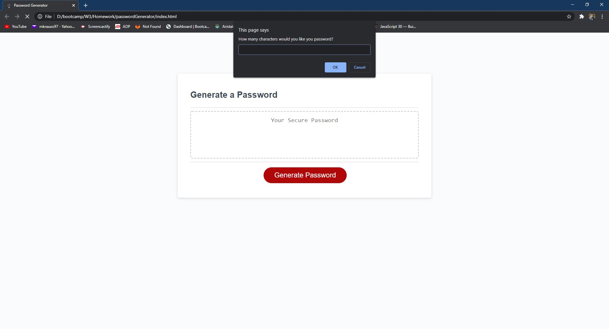

# passwordGenerator
A password generator that asks;
1. How long between 8 to 128 characters you would like it
2. If you would like uppercase letters
3. If you would like lowercase letters
4. If you would like numbers
5. If you would like special characters

it will alert if the number specified is not a number or if it not between 8 and 128.
it will also alert if they respond no to each question of what they would like their password to contain.

link to deployed application src=https://mknauss97.github.io/passwordGenerator/

